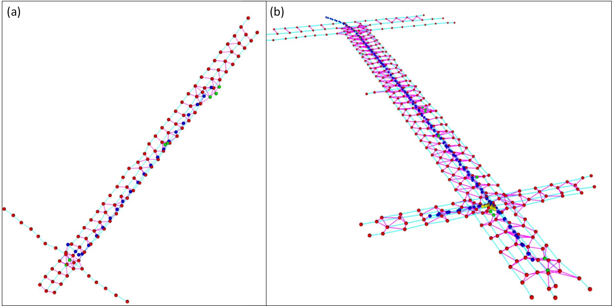
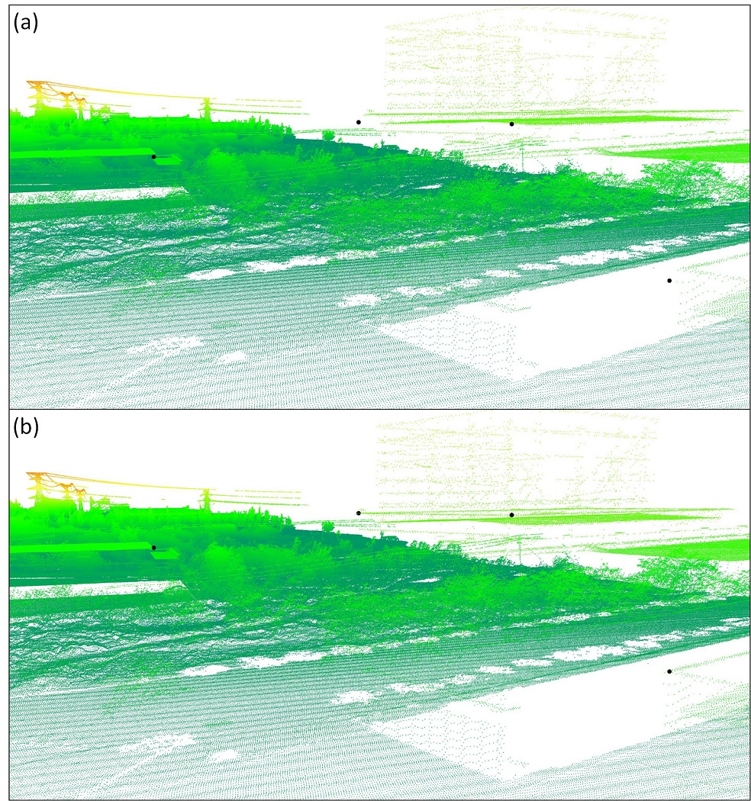
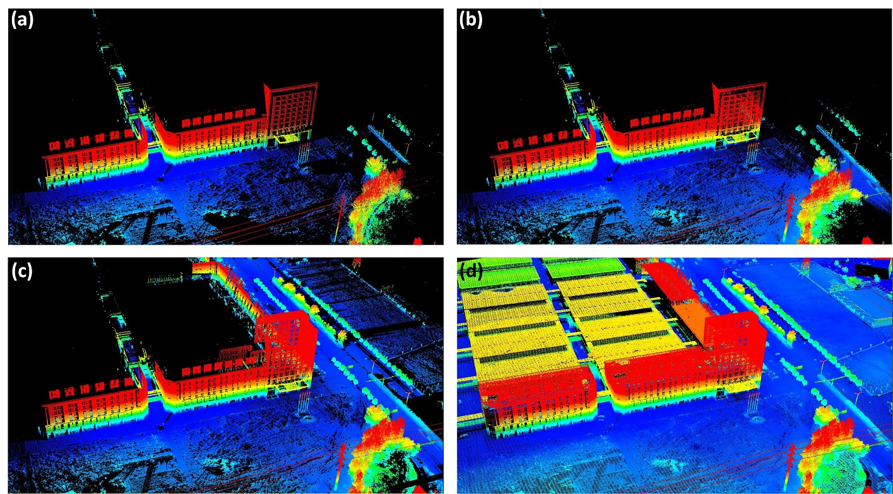
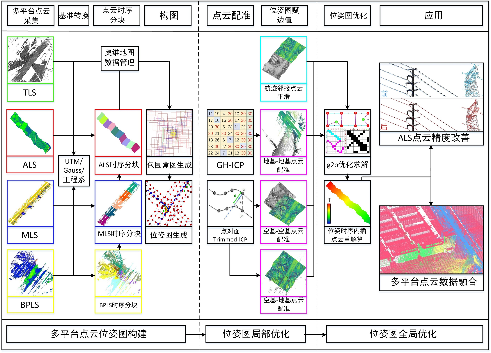

# ALS_Refine
Codes for ALS refinement using TLS or MLS data for highway expansion and reconstruction egineering

 
 Generated Pose Graph (Red: ALS block, Green: TLS station, Blue: MLS block, Yellow: BPLS block, Cyan: Adjacent Smooth Edge, Purple: Overlapping Registration Edge)
 
 
ALS correction result: (a) Before optimization (b) After optimization

 
 Multi-template point cloud data fusion result (a) TLS (b) TLS+BPLS (c)TLS+BPLS+MLS (d)TLS+BPLS+MLS+ALS
 
 
 'Control Cloud' multi-template point cloud pose graph optimization framework
 
